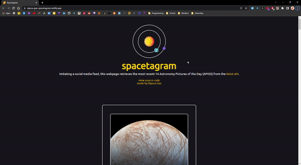
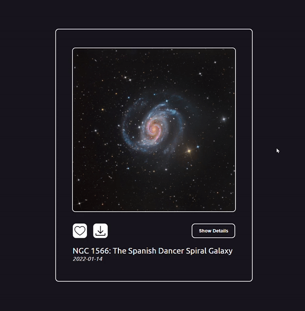
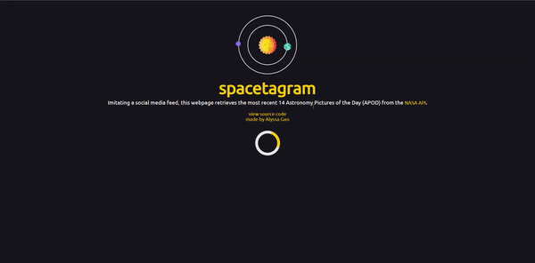
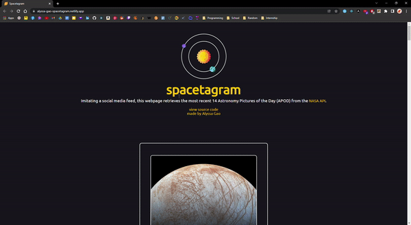
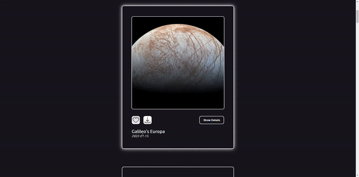

# Spacetagram 🌌

This is a single page application that retrieves the most recent 14 Astronomy Pictures of the Day (APOD) from the [NASA API](https://api.nasa.gov/) and showcases them like a social media feed.

This is my submission for the Summer 2022 Shopify Front End Developer Intern Challenge: https://alyssa-gao-spacetagram.netlify.app/

## Basic Functions
Please see [here](https://docs.google.com/document/d/13zXpyrC2yGxoLXKktxw2VJG2Jw8SdUfliLM-bYQLjqE/edit#) for the detailed requirements.
- Fetch data from APOD (NASA’s API) and display the resulting images
- Display descriptive data for each image (for example: title, date, description, etc.)
- Like/Unlike an image

## Additional Features
### Save likes if the user leaves or reloads the page (using local storage)
Using `localStorage`, likes will be saved/updated until the browser cache/cookies are cleared.

### Animate the “like” action
The user can interact with the like button to like/unlike an image.

### Add a loading state while we wait for NASA’s API to return data
Initially, when the page loads, a yellow loader is shown until the data is retrieved from the API.

### Create shareable links for each image
When the user clicks on the share/save button, a popup will alert that the browser will open a new tab with the image and shareable url.

### Option to show/hide details
The user has the option to show or hide the description for each card. The card height will adjust based on the button click. 

### Responsive Design
The page renders well on a variety of devices and window or screen sizes. 

## Tech Stack
This application was created with React.

In the project directory, you can run:

### `npm start`

Runs the app in the development mode.\
Open [http://localhost:3000](http://localhost:3000) to view it in your browser.

The page will reload when you make changes.\
You may also see any lint errors in the console.

### `npm test`

Launches the test runner in the interactive watch mode.\
See the section about [running tests](https://facebook.github.io/create-react-app/docs/running-tests) for more information.

### `npm run build`

Builds the app for production to the `build` folder.\
It correctly bundles React in production mode and optimizes the build for the best performance.

The build is minified and the filenames include the hashes.\
Your app is ready to be deployed!

See the section about [deployment](https://facebook.github.io/create-react-app/docs/deployment) for more information.

### `npm run eject`

**Note: this is a one-way operation. Once you `eject`, you can't go back!**

If you aren't satisfied with the build tool and configuration choices, you can `eject` at any time. This command will remove the single build dependency from your project.

Instead, it will copy all the configuration files and the transitive dependencies (webpack, Babel, ESLint, etc) right into your project so you have full control over them. All of the commands except `eject` will still work, but they will point to the copied scripts so you can tweak them. At this point you're on your own.

You don't have to ever use `eject`. The curated feature set is suitable for small and middle deployments, and you shouldn't feel obligated to use this feature. However we understand that this tool wouldn't be useful if you couldn't customize it when you are ready for it.
